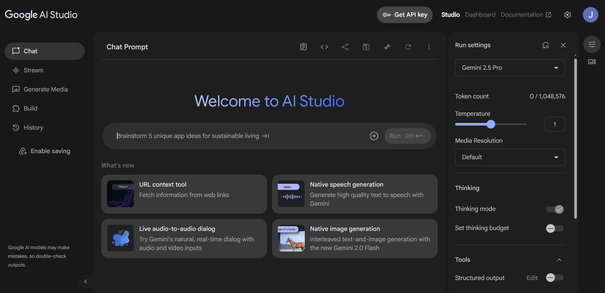

# Creating a CLI AI Agent with Gemini

## Overview
In this project, I wanted to try practice setting up environment files and to better understand how AI agents work under the hood. The model that was used for this project was gemini-2.0-flash-001 as it can be used for free.

## Project Summary
I started this project by creating a virtual environment and then using requirements.txt to load the dependencies into it. The two dependencies that are needed are google-genai in order to use the model properly and python-dotenv to create an environment file to store the API key. I then needed to create a google studio account to create an API key [here](https://aistudio.google.com/). Once signed in you will see this page:



Click the "Create API Key" button in the top right. From there, I created a .env file in my local repository with a variable called GEMINI_API_KEY. I set it equal to the generated API key from google studio. For further information, the documentation on API keys can be found [here](https://ai.google.dev/gemini-api/docs/api-key). It is **VERY IMPORTANT** to create a .gitignore file and add both venv and the .env file to it. If forgotten, the API key would be visible to anyone with access to the repository when pushed.
From here, I imported the necessary component from dotenv to load the environment file. I called load_dotenv to load the environment and then stored os.environ.get(GEMINI_API_KEY) in a variable to get access to it in the future like so:

### Environment Loading
```
    load_dotenv()
    api_key = os.environ.get("GEMINI_API_KEY")
    client = genai.Client(api_key=api_key)
```


 I used the API key to create a client based on the documentation found [here](https://googleapis.github.io/python-genai/#create-a-client). Next, imported types from genai to create a list that contains types.Content to hold the user prompt. I then defined a --verbose flag to present the user prompt and token usages if requested.

I wanted to give the model functions that it could execute as proof of concept. I used the [types.FunctionDeclaration](https://ai.google.dev/gemini-api/docs/function-calling?example=meeting) and [types.Schema](https://ai.google.dev/gemini-api/docs/structured-output) to build out the function structure for the model like so:

### Example Function Schema
```
    schema_run_python_file = types.FunctionDeclaration(
        name="run_python_file",
        description="Executes python file in the specified directory, constrained to the working directory.",
        parameters=types.Schema(
            type=types.Type.OBJECT,
            properties={
                "file_path": types.Schema(
                type=types.Type.STRING,
                description="The directory or file path to the file to execute, relative to the working directory. If not provided, say no file to execute.",
                ),
            },
        ),
    )
```

 I created a function in main.py to handle function calls for the model. I then created a function folder and defined each distinct function in their own file. So the model could use the functions and produce output, I created function to handle feeding the input to the model and output generation. It runs in a set loop so that it wont infinitely run. It runs the generate_content function which feeds the model the input, checks to see if a function call was made in the response contents, runs the function if there is, and produces an output back to the command line based on the input.


## Potential Future Additions/Projects
- More Functions
- Encorporate GUI
- Make A Gemini Clone

## Final Thoughts
It was interesting applying API key management appropriately, as well as seeing how interacting with the gemini API works. It has given me a better understanding of how AI tools people use daily work under the hood, and will help me in future projects if I want to implement something using a pre-built commercial model.